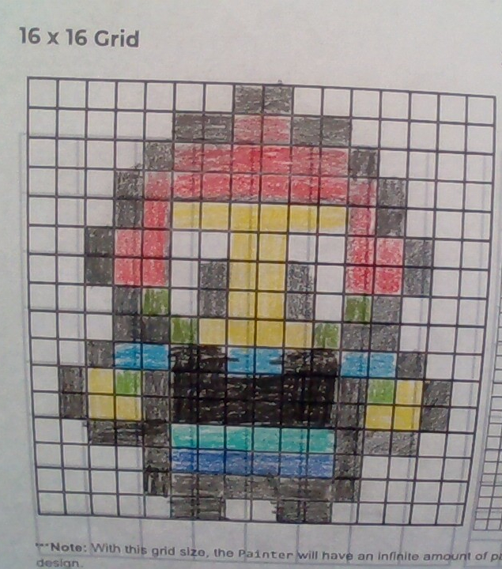
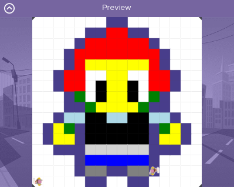

# Unit 1 - Asphalt Art

## Introduction

Cities use asphalt art to improve public safety, inspire their residents and visitors, and brighten communities. Your goal is to create asphalt art to revitalize The Neighborhood and bring the community together with the help of the Painter.

## Requirements

Use your knowledge of object-oriented programming, algorithms, the problem solving process, and decomposition strategies to create asphalt art:
- **Create a new subclass** – Create at least one new subclass of the PainterPlus class that is used for a component of the asphalt art design.
- **Plan an algorithm** – Use the problem solving process and decomposition strategies to plan an algorithm that incorporates a combination of sequencing, selection, and/or iteration.
- **Write a method** – Write at least one method in a PainterPlus subclass that contributes to a component of the asphalt art design.
- **Document your code** – Use comments to explain the purpose of the methods and code segments.

## Notes: Neighborhood & Painter Class

This project was created on Code.org's JavaLab platform using the built in Neightborhood GUI output. To test and edit this project you must build in Code.org's JavaLab with the Neighborhood GUI enabled. For reference to the Painter class documentation, [you can read more here.](https://studio.code.org/docs/ide/javalab/classes/Painter)

## Output:

### Sketch

### Final Image

## Reflection

1. Describe your project.

   - My project, in detail, is a character from the game Fortnite: Toona Fish. He is my main skin in the game and I edited him to look like an avatar I made. I had in feature in my PBL last year, but ended up scrapping it. I took the concept art for his character and adjusted it to the 16x16 art.

2. What are two things about your project that you are proud of?

   - Two things I am proud of about my project is that one, I was able to finish the coding before the due date even though I couldn't figure out while loops and if/else statements. Secondly, I'm proud of being able to replicate my digital art so well, while only using simple methods. It was fun recreating my character, and I'm glad I was able to get it done.

3. Describe something you would improve or do differently if you had an opportunity to change something about your project.

   - One thing I would completely do differently is change the code to use if/else statements and while loop so that the code is much more smaller. My background and character painters had like 500+ code in it, and it could be way smaller with those. If only I could figure out how to use them correctly.